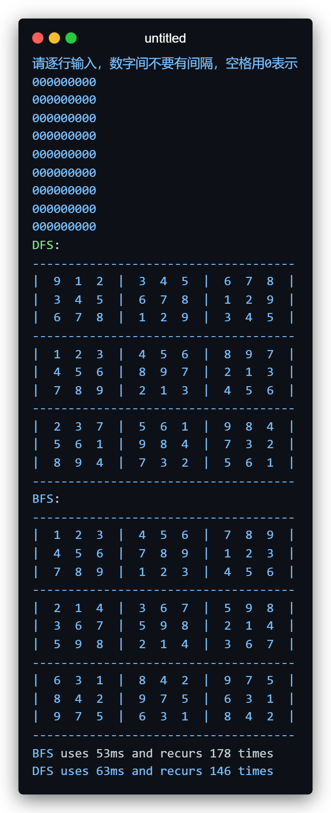

# Sudoku-Studio
数独游戏再见！！
 author: 张奥

此demo采用DFS和BFS两种方法解决了数独问题


在广搜或深搜之前，除了对sudoku进行初始化，更重要的是对sudoku进行了update()操作，这样也可以使得一些简单的数独不经过搜索也能得到答案。
update()是对数独的一种更新操作，其逻辑为：若当前数独中存在可以填写1个唯一确定数字的空格，则将其填上；由于填上后有可能致使其他某个空格也唯一确定，故此方法会递归调用update()其本身，直到数独内所有空格都有至少2个可能填上的数字。

## Docker Support
```shell
# build
docker build . -t sudoku

# run
docker run -it sudoku
```

